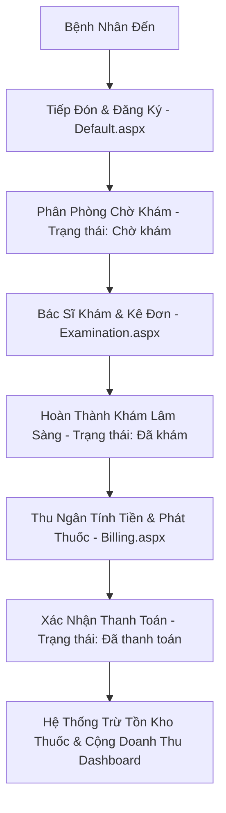

# Hệ Thống Quản Lý Phòng Khám HIS Clinic

Dự án **HIS Clinic** là một ứng dụng quản lý thông tin bệnh viện/phòng khám (Hospital Information System) thu nhỏ được xây dựng trên nền tảng **ASP.NET Web Forms (.NET Framework 4.7.2)** và **MS SQL Server**.

Hệ thống cung cấp một quy trình khép kín từ khâu tiếp đón bệnh nhân, khám bệnh lâm sàng, kê đơn thuốc, cho tới tính tiền viện phí phát thuốc và cập nhật báo cáo doanh thu, tồn kho theo thời gian thực.

---

## 🛠️ Công Nghệ Sử Dụng

- **Backend**: C# / .NET Framework 4.7.2, ADO.NET (SqlClient)
- **Frontend**: ASP.NET Web Forms (ASPX), HTML5, CSS3 (Hệ thống CSS Premium, responsive), jQuery, FontAwesome 6
- **Database**: MS SQL Server (Kết nối thông qua ConnectionString ở [Web.config](file:///e:/Repo/HIS/HIS/Web.config))
- **Web Server**: IIS Express (Cấu hình cổng mặc định `53559`)

---

## 📂 Cấu Trúc Dự Án Chính

- **[database_schema.sql](file:///e:/Repo/HIS/database_schema.sql)**: Chứa toàn bộ tập lệnh tạo cơ sở dữ liệu `HIS_DB`, cấu trúc bảng (Doctors, Patients, Visits, Medications, Examinations, Prescriptions, PrescriptionDetails) và các Stored Procedures chính.
- **[HIS/DatabaseHelper.cs](file:///e:/Repo/HIS/HIS/DatabaseHelper.cs)**: Lớp tĩnh quản lý toàn bộ các tương tác ADO.NET với SQL Server (thêm bệnh nhân, cập nhật khám bệnh, xử lý giao dịch thanh toán viện phí, điều chỉnh kho thuốc, tính toán doanh thu).
- **[HIS/Default.aspx](file:///e:/Repo/HIS/HIS/Default.aspx)**: Trang Tiếp nhận & Đăng ký khám. Hiển thị Dashboard thống kê nhanh (Tổng số tiếp nhận, số ca chờ khám, số ca đã khám và tổng doanh thu hôm nay) cùng danh sách lượt khám trong ngày.
- **[HIS/Examination.aspx](file:///e:/Repo/HIS/HIS/Examination.aspx)**: Phòng khám của Bác sĩ. Cho phép xem bệnh án hành chính, nhập triệu chứng, chẩn đoán y khoa, kê toa thuốc và xem lịch sử khám trước đây của bệnh nhân.
- **[HIS/Billing.aspx](file:///e:/Repo/HIS/HIS/Billing.aspx)**: Phân hệ Thu ngân & Phát thuốc. Hiển thị danh sách ca chờ thanh toán, tự động tải hóa đơn tạm tính theo đơn giá thực tế trong kho thuốc, xác nhận thanh toán (tự động trừ kho) và hỗ trợ in hóa đơn thuốc mẫu.
- **[HIS/Medications.aspx](file:///e:/Repo/HIS/HIS/Medications.aspx)**: Trang quản trị danh mục thuốc. Cho phép thêm mới, sửa đơn giá, nhập kho, xóa thuốc và hiển thị cảnh báo tồn kho thấp dưới `50` viên.
- **[HIS/Site.Master](file:///e:/Repo/HIS/HIS/Site.Master)**: Bố cục chung của trang web (Premium Left Sidebar Menu và Sticky Top Header cùng đồng hồ hệ thống).

---

## 🔄 Luồng Nghiệp Vụ Khép Kín Của Phòng Khám



1. **Tiếp nhận**: Bệnh nhân được đăng ký và phân bổ bác sĩ khám tại trang chủ. Trạng thái mặc định là `Chờ khám`.
2. **Khám bệnh**: Bác sĩ chọn bệnh nhân trong danh sách chờ, ghi nhận triệu chứng, đưa ra chẩn đoán và kê toa thuốc. Sau khi lưu, trạng thái đổi thành `Đã khám` (Khám xong).
3. **Thanh toán**: Nhân viên thu ngân chọn bệnh nhân từ danh sách chờ thanh toán (hoặc nhấp phím tắt **Viện phí** từ trang chủ). Hệ thống tự động nhân `Số lượng * Đơn giá thuốc` thực tế trong danh mục để ra tổng tiền hóa đơn.
4. **Phát thuốc**: Khi ấn nút **Xác Nhận Thanh Toán**, hệ thống chạy một Transaction để:
   - Cập nhật trạng thái lượt khám thành `Đã thanh toán`.
   - Giảm trừ số lượng tồn kho của từng loại thuốc tương ứng trong bảng `Medications`.
   - Cộng dồn doanh thu vào mục **Doanh Thu Hôm Nay** trên Dashboard trang chủ.

---

## 🚀 Hướng Dẫn Vận Hành Hệ Thống

### Bước 1: Khởi Tạo Cơ Sở Dữ Liệu
1. Mở phần mềm quản lý cơ sở dữ liệu **SQL Server Management Studio (SSMS)**.
2. Mở tệp [database_schema.sql](file:///e:/Repo/HIS/database_schema.sql) và bấm **Execute** để tạo cơ sở dữ liệu `HIS_DB`, các bảng và thủ tục lưu trữ mẫu.

### Bước 2: Cấu Hình Kết Nối Dữ Liệu
Mở tệp [Web.config](file:///e:/Repo/HIS/HIS/Web.config) và điều chỉnh chuỗi kết nối (ConnectionString) tại thẻ `<connectionStrings>` cho khớp với thông tin SQL Server trên máy tính của ngài:
```xml
<add name="HISConnection" 
     connectionString="Server=YOUR_SERVER_NAME;Database=HIS_DB;User ID=sa;Password=YOUR_PASSWORD;TrustServerCertificate=True;" 
     providerName="System.Data.SqlClient" />
```

### Bước 3: Biên Dịch Dự Án
Ngài có thể biên dịch dự án bằng **Visual Studio** (mở tệp `HIS.slnx` hoặc `HIS.csproj` rồi bấm Build) hoặc sử dụng **MSBuild** qua dòng lệnh:
```powershell
# Ví dụ biên dịch qua MSBuild
& "C:\Program Files\Microsoft Visual Studio\18\Community\MSBuild\Current\Bin\MSBuild.exe" HIS\HIS.csproj /t:Build /p:Configuration=Debug
```

### Bước 4: Khởi Chạy Trang Web
1. Ngài chạy tệp script [start.bat](file:///e:/Repo/HIS/start.bat) hoặc gõ lệnh `make start` để khởi động máy chủ **IIS Express** chạy dự án.
2. Mở trình duyệt web và truy cập địa chỉ: **[http://localhost:53559/](http://localhost:53559/)**
